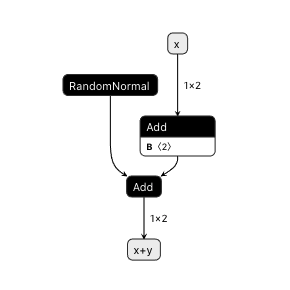
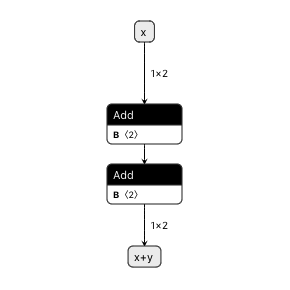

# onnx-remove-random-normal

This is a script to replace RandomNormal node with Constant node.

## Example

Imagine that we have something ONNX model like the following:

```python
import torch


class SomethingModel(torch.nn.Module):
    def __init__(self):
        super().__init__()

    def forward(self, x: torch.Tensor):
        y = torch.tensor([-1, 2], dtype=torch.float32)  # Constant node
        z = torch.randn(2, dtype=torch.float32)  # RandomNormal node
        return x + y + z


def export_onnx(path: str) -> None:
    x = torch.tensor([10, 20], dtype=torch.float32)
    model = SomethingModel()
    model.eval()

    torch.onnx.export(
        model, x, path,
        verbose=True,
        export_params=True,
        do_constant_folding=False,
        opset_version=11,
        input_names=['x'],
        output_names=['output'],
    )
```

`torch.randn(...)` will be converted into `RandomNormal` node in ONNX.
However, we can replace it with something constants in some cases.

```
$ python onnx_remove_random_normal.py --help
usage: onnx_remove_random_normal.py [-h] [--seed SEED] source output

Replace ONNX RandomNormal node with Constant Node

positional arguments:
  source       source onnx file
  output       output onnx file

optional arguments:
  -h, --help   show this help message and exit
  --seed SEED  random seed
$ python onnx_remove_random_normal.py before.onnx after.onnx
```

| Before | After |
| --- | --- |
|  |  |
